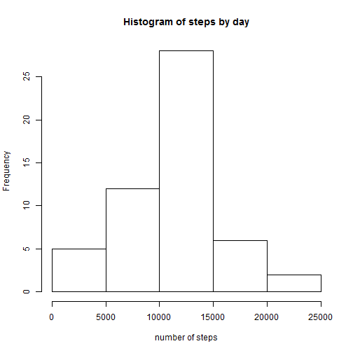
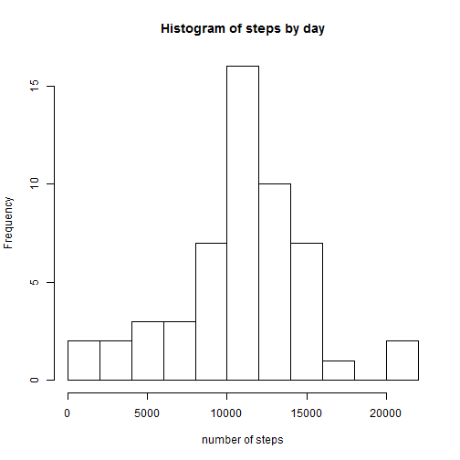
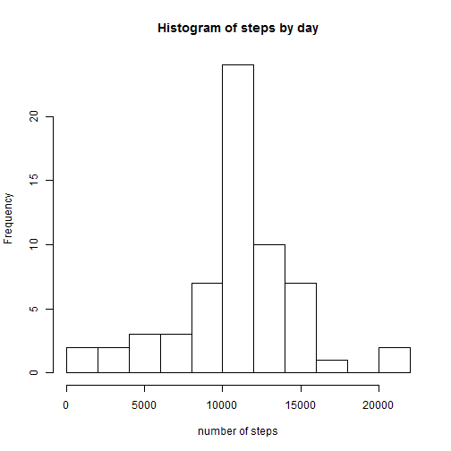

## Loading and preprocessing the data


```r
unzip("./repdata-data-activity.zip")
data <- read.csv("./activity.csv")
```

looking at data

```r
summary(data)
head(data)
str(data)
```

## What is mean total number of steps taken per day?

here i aggregate step numbers by date, which i will use later in histogram

```r
aggregate(steps ~ date, data = data, sum)
```

making histogram steps by day. at first look it looks like normal distribution just
with more thick first half

```r
hist(aggregate(steps ~ date, data = data, sum)$steps, main = "Histogram of steps by day",
     xlab = "number of steps")
```

 

here we can look at histogram more closely, using "breaks", and we see something
interseting - days with extra activity (more than 20000 steps)

```r
hist(aggregate(steps ~ date, data = data, sum)$steps, breaks = 10, main = "Histogram of steps by day",
     xlab = "number of steps")
```

 

### Mean number of steps by day

```r
mean(aggregate(steps ~ date, data = data, sum)$steps)
```

```
## [1] 10766.19
```

### Median number of steps by day

```r
median(aggregate(steps ~ date, data = data, sum)$steps)
```

```
## [1] 10765
```

## What is the average daily activity pattern?


```r
dailypattern <- aggregate(steps ~ interval, data = data, mean)
plot(dailypattern, type = "l")
```

 

the maximum number of steps contains interval # 835 (on average across all the days in the dataset)

```r
dailypattern[dailypattern$steps == max(dailypattern$steps), ]
```

```
##     interval    steps
## 104      835 206.1698
```


## Imputing missing values
lets see how many missing values are in the dataset

```r
sum(is.na(data$steps))
```

```
## [1] 2304
```

```r
sum(is.na(data$steps))/nrow(data)
```

```
## [1] 0.1311475
```
near 13% is missing

for this task i create a separate dataframe *"datawithoutNA"* in which i fill NA values
using the mean for that 5-minute interval 

```r
datawithoutNA <- data

for (i in 1:nrow(datawithoutNA)) {
        if (is.na(datawithoutNA$steps[i]) == TRUE) {
                datawithoutNA$steps[i] <- dailypattern$steps[dailypattern$interval == datawithoutNA$interval[i]]
        }
}
```
just checking there is no NA's

```r
sum(is.na(datawithoutNA$steps)) 
```

```
## [1] 0
```

here i aggregate step numbers by date, which i will use later in histogram2

```r
aggregate(steps ~ date, data = datawithoutNA, sum)
```

making histogram2 steps by day

```r
hist(aggregate(steps ~ date, data = datawithoutNA, sum)$steps, main = "Histogram of steps by day",
     xlab = "number of steps")
```

 

here we can look at histogram more closely, using "breaks"

```r
hist(aggregate(steps ~ date, data = datawithoutNA, sum)$steps, breaks = 10, main = "Histogram of steps by day",
     xlab = "number of steps")
```

 

### Mean number of steps by day witout NA

```r
mean(aggregate(steps ~ date, data = datawithoutNA, sum)$steps)
```

```
## [1] 10766.19
```

### Median number of steps by day without NA

```r
median(aggregate(steps ~ date, data = datawithoutNA, sum)$steps)
```

```
## [1] 10766.19
```

### the is no difference between mean number of steps with and without NA


## Are there differences in activity patterns between weekdays and weekends?


### Version information

```r
sessionInfo()
```

```
## R version 3.1.3 (2015-03-09)
## Platform: x86_64-w64-mingw32/x64 (64-bit)
## Running under: Windows 8 x64 (build 9200)
## 
## locale:
## [1] LC_COLLATE=Russian_Russia.1251  LC_CTYPE=Russian_Russia.1251   
## [3] LC_MONETARY=Russian_Russia.1251 LC_NUMERIC=C                   
## [5] LC_TIME=Russian_Russia.1251    
## 
## attached base packages:
## [1] stats     graphics  grDevices utils     datasets  methods   base     
## 
## other attached packages:
## [1] knitr_1.9
## 
## loaded via a namespace (and not attached):
##  [1] digest_0.6.8    evaluate_0.5.5  formatR_1.0     htmltools_0.2.6
##  [5] markdown_0.7.4  mime_0.2        rmarkdown_0.5.1 stringr_0.6.2  
##  [9] tools_3.1.3     yaml_2.1.13
```
